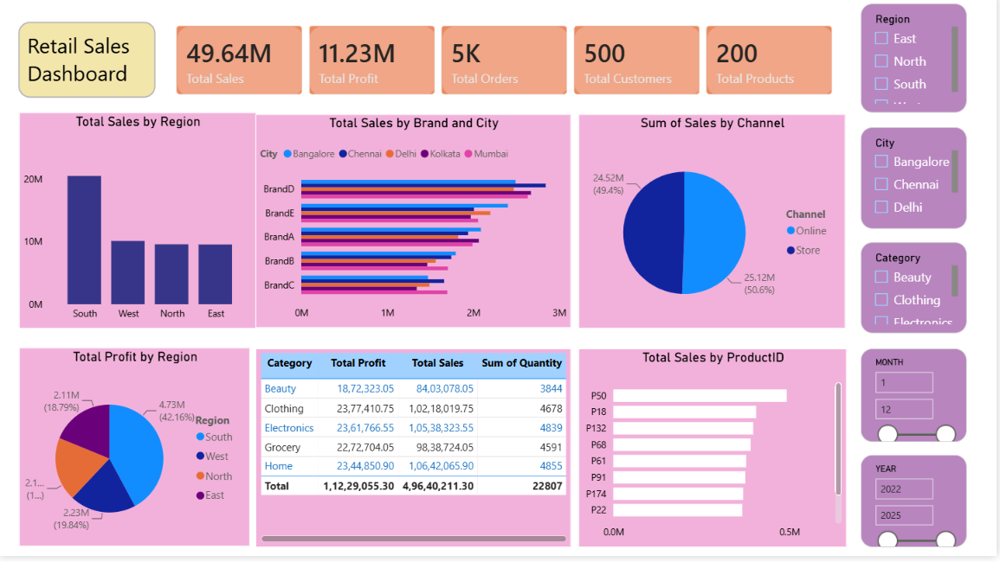
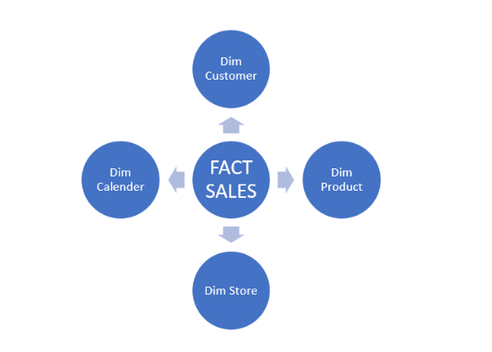
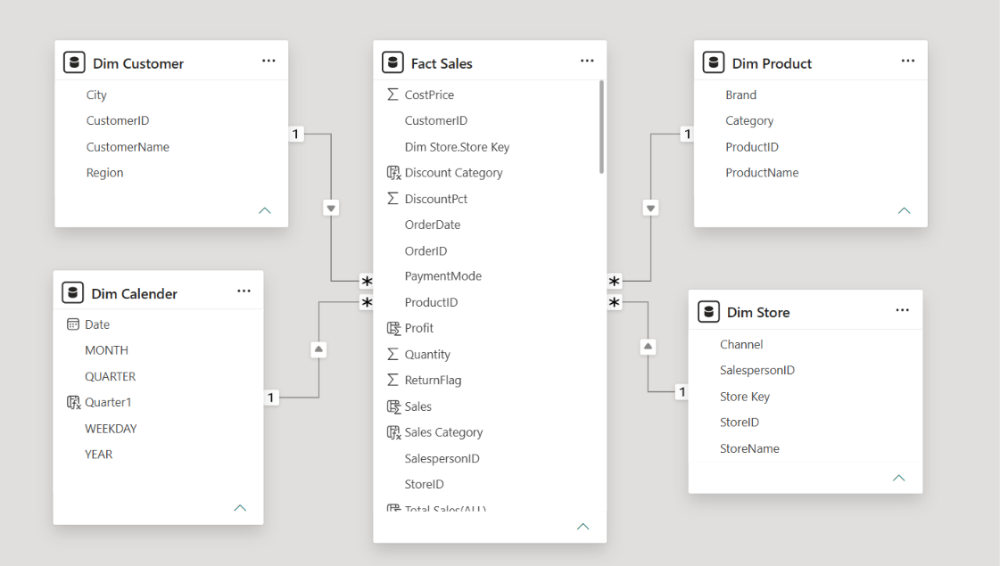

# 🛍️ Retail Sales Dashboard — Power BI

An interactive Power BI dashboard analyzing multi-year retail sales performance across regions, cities, product categories, brands, and sales channels — built on a star-schema data model with 5,000 transactions spanning 2022–2025.


---

## 📌 Overview

This project transforms a raw multi-year retail transactions dataset into a two-page, decision-ready Power BI dashboard. It answers core retail questions — which regions and categories drive profit, how channels compare, and how sales trend year-over-year and month-over-month — through a clean star-schema model and DAX-driven KPIs.

| | |
|---|---|
| **Dashboard Title** | Retail Sales Dashboard |
| **Tool** | Power BI Desktop |
| **Data Model** | Star Schema (1 Fact table, 4 Dimension tables) |
| **Records** | 5,000 order lines |
| **Time Period** | Jan 2022 – Dec 2025 |
| **Pages** | Overview · Time Series Analysis |

---

## 🖼️ Dashboard Preview

**Page 1 — Overview**


**Page 2 — Time Series Analysis**


---

## 📊 KPIs

Both pages surface the same five headline metrics as KPI cards:

- **Total Sales**
- **Total Profit**
- **Total Orders**
- **Total Customers**
- **Total Products**

## 🎛️ Slicers (Filters)

Both pages share the same five slicers, so any filter selection stays consistent as you move between pages:

- **Region** (East / North / South / West)
- **City** (Bangalore / Chennai / Delhi / Kolkata / Mumbai)
- **Category** (Beauty / Clothing / Electronics / Grocery / Home)
- **Month**
- **Year** (2022–2025)

## 📈 Visuals by Page

**Overview**
- Total Sales by Region (column chart)
- Total Profit by Region (pie chart)
- Total Sales by Brand and City (clustered bar chart)
- Category summary table (Total Profit, Total Sales, Quantity)
- Sum of Sales by Channel — Online vs Store (pie chart)
- Total Sales by Product ID (bar chart)

**Time Series Analysis**
- Sales: Current Year vs Previous Year (line chart)
- Profit: Current Month vs Previous Month (clustered column chart)
- Total Sales % and Total Profit % by Category (clustered column chart)
- Online Sales by Quarter (line chart)

---

## 🗂️ Data Model

Star schema with **Fact Sales** at the center, connected to four dimension tables.

**Conceptual Model**


**Physical Model**


| Table | Key Fields |
|---|---|
| **Fact Sales** | OrderID, OrderDate, CustomerID, ProductID, StoreID, Sales, Profit, Quantity, CostPrice, DiscountPct, PaymentMode, ReturnFlag |
| **Dim Customer** | CustomerID, CustomerName, City, Region |
| **Dim Product** | ProductID, ProductName, Category, Brand |
| **Dim Store** | StoreID, StoreName, Channel, SalespersonID |
| **Dim Calender** | Date, Month, Quarter, Weekday, Year |

> Note: the calendar table is named **Dim Calender** in the model (not "Calendar") — kept as-is to match the working file.

---

## 📁 Repository Structure

```
retail-sales-dashboard/
│
├── Original Data/
│   └── retail-store-multiyear-dataset.xlsx     # Raw source dataset
│
├── Retail-Sales-Dashboard.pbix                  # Power BI dashboard file
│
├── Conceptual_Model.png                         # High-level table relationship diagram
├── Physical_Datamodel.png                       # Field-level data model diagram
├── Dashboard_Page1_Overview.png                 # Page 1 screenshot
├── Dasboard_Page2_Time_Series_Analysis.png       # Page 2 screenshot
│
├── Documentation.md                             # Full project documentation
└── README.md                                    # This file
```

---

## 📎 Files

| File | Description |
|---|---|
| [📊 Retail-Sales-Dashboard.pbix](Retail-Sales-Dashboard.pbix) | Power BI dashboard file — open in Power BI Desktop |
| [🗃️ Original Data/retail-store-multiyear-dataset.xlsx](Original%20Data/retail-store-multiyear-dataset.xlsx) | Raw source dataset (5,000 rows, 2022–2025) |
| [🧭 Conceptual_Model.png](Conceptual_Model.png) | High-level table relationship diagram |
| [🧱 Physical_Datamodel.png](Physical_Datamodel.png) | Field-level data model diagram |
| [🖼️ Dashboard_Page1_Overview.png](Dashboard_Page1_Overview.png) | Page 1 — Overview screenshot |
| [🖼️ Dasboard_Page2_Time_Series_Analysis.png](Dasboard_Page2_Time_Series_Analysis.png) | Page 2 — Time Series Analysis screenshot |
| [📄 Documentation.md](Documentation.md) | Full project documentation |
| [📘 README.md](https://github.com/DRasool7013/retail-sales-dashboard/blob/main/README.md) | This file |

---

## 🚀 Getting Started

**Requirements:** [Power BI Desktop](https://powerbi.microsoft.com/desktop/) (free)

1. Clone the repository
   ```bash
   git clone https://github.com/<your-username>/retail-sales-dashboard.git
   ```
2. Open `Retail-Sales-Dashboard.pbix` in Power BI Desktop.
3. If prompted, point the data source to `Original Data/retail-store-multiyear-dataset.xlsx` and click **Refresh**.
4. Use the slicers on the right of each page to filter by Region, City, Category, Month, or Year.

---

## 🧩 How the Slicers Were Added

1. Select a blank area of the canvas.
2. In the **Visualizations** pane, choose the **Slicer** visual.
3. Drag the target field (e.g. `Dim Customer.Region`) into the slicer's **Field** well.
4. Repeat for City, Category, Month, and Year, positioning them in the right-hand panel.
5. Format each slicer (**Format pane → Slicer settings**) as a checkbox/list style for multi-select filtering.
6. Copy the five slicers onto the second page (or use **View → Sync Slicers** to keep selections synced across both pages) so filters apply consistently to every visual.

---

## 🔍 Key Insights

- Store and Online channels are nearly evenly split (**50.6% vs 49.4%** of sales).
- The **South** region leads both in sales and profit share (**42.16%** of total profit).
- **Clothing** and **Electronics** are the strongest profit-contributing categories; **Beauty** trails the other four.
- Sales show a clear cyclical current-year-vs-prior-year pattern rather than flat, uniform growth.

See **[Documentation.md](https://github.com/DRasool7013/retail-sales-dashboard/blob/main/Documentation.md)** for the full write-up: data prep steps, DAX measures, and detailed business-question answers.

---

## 🛠️ Tech Stack

- **Power BI Desktop** — data modeling, DAX, visualization
- **Power Query** — data cleaning and transformation
- **Excel** — source dataset

---


## 👤 Author

Built as a data analytics portfolio project.
